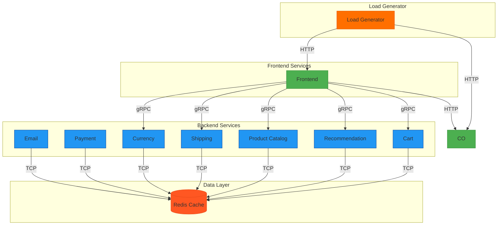

# GKE Microservices Demo Deployment  
[](LICENSE)  
> Kubernetes deployment of Google's microservices demo on Google Kubernetes Engine (GKE).

This project deploys a cloud-native e-commerce application using Kubernetes on GKE. The deployment is based on Google's [microservices-demo](https://github.com/GoogleCloudPlatform/microservices-demo) with custom configurations optimized for GKE.

## 📦 Included Services

| Service                  | Port  | Replicas | Function                         |
|--------------------------|-------|----------|----------------------------------|
| `frontend`               | 8080  | 2        | Web interface (LoadBalancer)     |
| `checkoutservice`        | 5050  | 2        | Order processing                 |
| `cartservice`            | 7070  | 2        | Shopping cart management         |
| `productcatalogservice`  | 3550  | 2        | Product database                 |
| `currencyservice`        | 7000  | 2        | Currency conversion              |
| `paymentservice`         | 50051 | 2        | Payment processing               |
| `shippingservice`        | 50051 | 2        | Shipping logic                   |
| `emailservice`           | 8080  | 1        | Email notifications              |
| `recommendationservice`  | 8080  | 2        | Product recommendations          |
| `adservice`              | 9555  | 2        | Advertising promotions           |
| `redis-cart`             | 6379  | 2        | Redis cache for carts            |

## 🚀 Deployment Steps
### Prerequisites
- Google Cloud Project with billing enabled
- [gcloud CLI](https://cloud.google.com/sdk/docs/install) installed
- Kubernetes cluster running on GKE

### 1. Apply Kubernetes Configuration
```bash
kubectl apply -f microservices-demo.yaml
```
### 2. Verify Deployment Status
```bash
kubectl get deployments
kubectl get services  # Note the EXTERNAL-IP of `frontend`
```
### 3. Access the Application
```bash
kubectl get service frontend
```
Open http://<EXTERNAL_IP> in your browser.

## 🔧 Configuration Highlights
* Resource Constraints: CPU/memory limits defined for all services (e.g., emailservice capped at 200m CPU/128Mi memory).
* Health Checks: Liveness/readiness probes using gRPC or HTTP.
* Redis Persistence: emptyDir volume for cart data.
* Environment Variables: Service discovery via Kubernetes DNS (e.g., CART_SERVICE_ADDR: "cartservice:7070").
## 🧹 Cleanup
```bash
kubectl delete -f microservices-demo.yaml
```
## 📜 License
* This deployment configuration is licensed under the Apache License 2.0.
* The microservices application is owned by Google. See original [repo](https://github.com/GoogleCloudPlatform/microservices-demo) for details.
  
