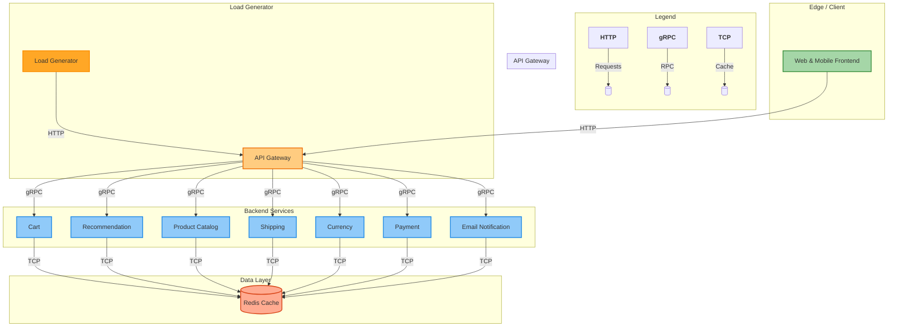

# GKE Microservices Demo Deployment  
[](LICENSE)  
> Kubernetes deployment of Google's microservices demo on Google Kubernetes Engine (GKE).

This project deploys a cloud-native e-commerce application using Kubernetes on GKE. The deployment is based on Google's [microservices-demo](https://github.com/GoogleCloudPlatform/microservices-demo) with custom configurations optimized for GKE.

## 📦 Included Services

| Service                  | Port  | Replicas | Function                         |
|--------------------------|-------|----------|----------------------------------|
| `frontend`               | 8080  | 2        | Web interface (LoadBalancer)     |
| `checkoutservice`        | 5050  | 2        | Order processing                 |
| `cartservice`            | 7070  | 2        | Shopping cart management         |
| `productcatalogservice`  | 3550  | 2        | Product database                 |
| `currencyservice`        | 7000  | 2        | Currency conversion              |
| `paymentservice`         | 50051 | 2        | Payment processing               |
| `shippingservice`        | 50051 | 2        | Shipping logic                   |
| `emailservice`           | 8080  | 1        | Email notifications              |
| `recommendationservice`  | 8080  | 2        | Product recommendations          |
| `adservice`              | 9555  | 2        | Advertising promotions           |
| `redis-cart`             | 6379  | 2        | Redis cache for carts            |

## 🚀 Deployment Steps
### Prerequisites
- Google Cloud Project with billing enabled
- [gcloud CLI](https://cloud.google.com/sdk/docs/install) installed
- Kubernetes cluster running on GKE

### 1. Apply Kubernetes Configuration
```bash
kubectl apply -f microservices-demo.yaml
```
### 2. Verify Deployment Status
```bash
kubectl get deployments
kubectl get services  # Note the EXTERNAL-IP of `frontend`
```
### 3. Access the Application
```bash
kubectl get service frontend
```
Open http://<EXTERNAL_IP> in your browser.

## 🔧 Configuration Highlights
* Resource Constraints: CPU/memory limits defined for all services (e.g., emailservice capped at 200m CPU/128Mi memory).
* Health Checks: Liveness/readiness probes using gRPC or HTTP.
* Redis Persistence: emptyDir volume for cart data.
* Environment Variables: Service discovery via Kubernetes DNS (e.g., CART_SERVICE_ADDR: "cartservice:7070").
## 🧹 Cleanup
```bash
kubectl delete -f microservices-demo.yaml
```
## 📜 License
* This deployment configuration is licensed under the Apache License 2.0.
* The microservices application is owned by Google. See original [repo](https://github.com/GoogleCloudPlatform/microservices-demo) for details.
```mermaid
flowchart TD
    %% Legend
    subgraph Legend
        direction LR
        HTTP[<b>HTTP</b>]:::http -.->|Client Requests| Placeholder
        gRPC[<b>gRPC</b>]:::grpc -.->|Internal RPC| Placeholder
        TCP[<b>TCP</b>]:::tcp -.->|Cache Access| Placeholder
    end

    %% Traffic Sources
    subgraph TrafficSources["Traffic Sources"]
        direction TB
        LG[Load Generator\n<small>Simulated User Traffic</small>]:::loadgen
        UA[End Users\n<small>Web & Mobile Clients</small>]:::client
    end

    %% Edge Services
    subgraph EdgeLayer["Edge Layer"]
        APIGW[API Gateway\n<small>Request Routing\nAuth | Rate Limiting</small>]:::gateway
    end

    %% Business Services
    subgraph BusinessServices["Business Services Layer"]
        direction LR
        PC[Product Catalog\n<small>Product Data</small>]:::service
        REC[Recommendation\n<small>Personalized Suggestions</small>]:::service
        CART[Cart Service\n<small>Cart Management</small>]:::service
        SHIP[Shipping Service\n<small>Delivery Logic</small>]:::service
        CURR[Currency Service\n<small>FX Conversion</small>]:::service
        PAY[Payment Service\n<small>Transaction Processing</small>]:::service
        EMAIL[Email Service\n<small>Notifications</small>]:::service
    end

    %% Data Layer
    subgraph DataLayer["Data Layer"]
        RC[(Redis Cache\n<small>Distributed Caching\nSession Storage</small>)]:::database
    end

    %% Connections
    %% Traffic to Edge
    LG -->|HTTP Load Testing| APIGW
    UA -->|User Requests| APIGW

    %% Edge to Services
    APIGW -->|gRPC| PC
    APIGW -->|gRPC| REC
    APIGW -->|gRPC| CART
    APIGW -->|gRPC| SHIP
    APIGW -->|gRPC| CURR
    APIGW -->|gRPC| PAY
    APIGW -->|gRPC| EMAIL

    %% Services to Cache
    CART  -->|TCP| RC
    REC   -->|TCP| RC
    PC    -->|TCP| RC
    SHIP  -->|TCP| RC
    CURR  -->|TCP| RC
    PAY   -->|TCP| RC
    EMAIL -->|TCP| RC

    %% Styling
    classDef loadgen fill:#FFA726,stroke:#EF6C00,stroke-width:2px;
    classDef client fill:#81C784,stroke:#388E3C,stroke-width:2px;
    classDef gateway fill:#FFF176,stroke:#F57F17,stroke-width:2px;
    classDef service fill:#81D4FA,stroke:#0288D1,stroke-width:2px;
    classDef database fill:#FFAB91,stroke:#D84315,stroke-width:2px;
    classDef http fill:#BA68C8,stroke:#7B1FA2;
    classDef grpc fill:#4FC3F7,stroke:#0277BD;
    classDef tcp fill:#AED581,stroke:#689F38;
```
  
