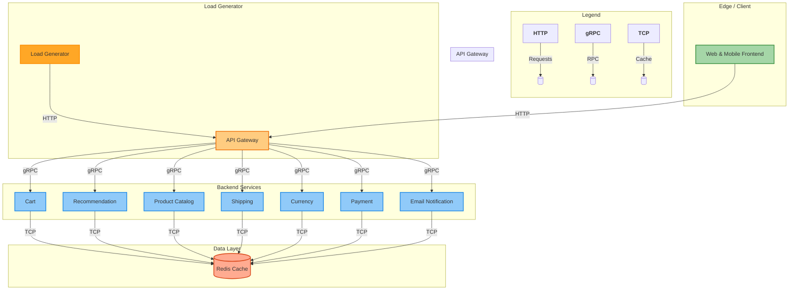

# GKE Microservices Demo Deployment with Helm

[](https://opensource.org/licenses/Apache-2.0)
[](https://kubernetes.io/)
[](https://helm.sh)
[](https://cloud.google.com/)

This repository provides a production-ready Helm chart for deploying Google's **Online Boutique** microservices demo onto a Google Kubernetes Engine (GKE) cluster. It is designed for easy, repeatable, and configurable deployments suitable for demonstrations and testing environments.

This project implements a cloud-native e-commerce application on GKE with:
- **Helm-based deployment** for environment management
- **GitOps-ready structure** with separate value files
- **Optimized configurations** for GKE environments
- **Automated service discovery** via Kubernetes DNS

## 📦 Included Services

| Service                  | Port  | Replicas | Function                         |
|--------------------------|-------|----------|----------------------------------|
| `frontend`               | 8080  | 2        | Web interface (LoadBalancer)     |
| `checkoutservice`        | 5050  | 2        | Order processing                 |
| `cartservice`            | 7070  | 2        | Shopping cart management         |
| `productcatalogservice`  | 3550  | 2        | Product database                 |
| `currencyservice`        | 7000  | 2        | Currency conversion              |
| `paymentservice`         | 50051 | 2        | Payment processing               |
| `shippingservice`        | 50051 | 2        | Shipping logic                   |
| `emailservice`           | 8080  | 1        | Email notifications              |
| `recommendationservice`  | 8080  | 2        | Product recommendations          |
| `adservice`              | 9555  | 2        | Advertising promotions           |
| `redis-cart`             | 6379  | 2        | Redis cache for carts            |

## 🚀 Deployment Steps
### Prerequisites
- A Google Cloud Project with billing enabled.

- gcloud CLI: Installation Guide
- Authenticate and set your project:
  ```bash
     gcloud auth login
     gcloud config set project [YOUR_PROJECT_ID]
  ```
- kubectl: Installed and configured to interact with your cluster.
- Helm v3: [
- A running GKE Cluster: GKE Quickstart

### 1. Deploy using Helm
```bash
# Option 1: Install individual service
helm install checkoutservice charts/microservice -f values/checkout-service-values.yaml

# Option 2: Full deployment (using helmfile)
helmfile sync

# Option 3: One-click install
./install.sh
```
### 2. Verify Deployment Status
```bash
helm list
kubectl get pods
kubectl get service frontend  # Note EXTERNAL-IP
```
### 3. Access the Application
```bash
kubectl get service frontend
Or
open http://$(kubectl get svc frontend -o jsonpath='{.status.loadBalancer.ingress[0].ip}')
```
Open http://<EXTERNAL_IP> in your browser.

## 🔧 Configuration Highlights
* Resource Constraints: CPU/memory limits defined for all services (e.g., emailservice capped at 200m CPU/128Mi memory).
* Health Checks: Liveness/readiness probes using gRPC or HTTP.
* Redis Persistence: emptyDir volume for cart data.
* Environment Variables: Service discovery via Kubernetes DNS (e.g., CART_SERVICE_ADDR: "cartservice:7070").
## 🧹 Cleanup
```bash
# Full uninstall
./uninstall.sh

# Selective removal
helm uninstall checkoutservice
```
## 📜 License
* This deployment configuration is licensed under the Apache License 2.0.
* The microservices application is owned by Google. See original [repo](https://github.com/GoogleCloudPlatform/microservices-demo) for details.
  
